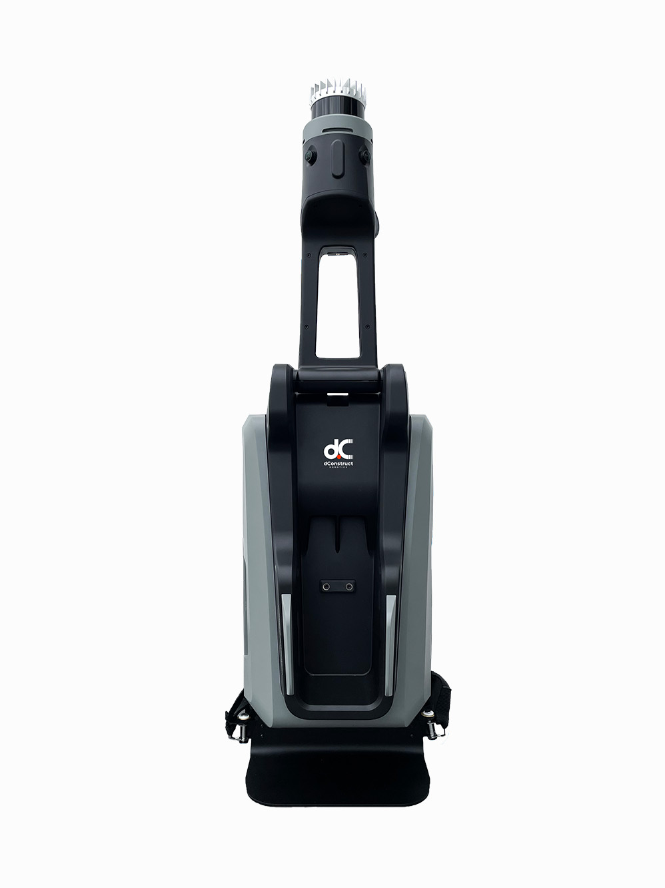
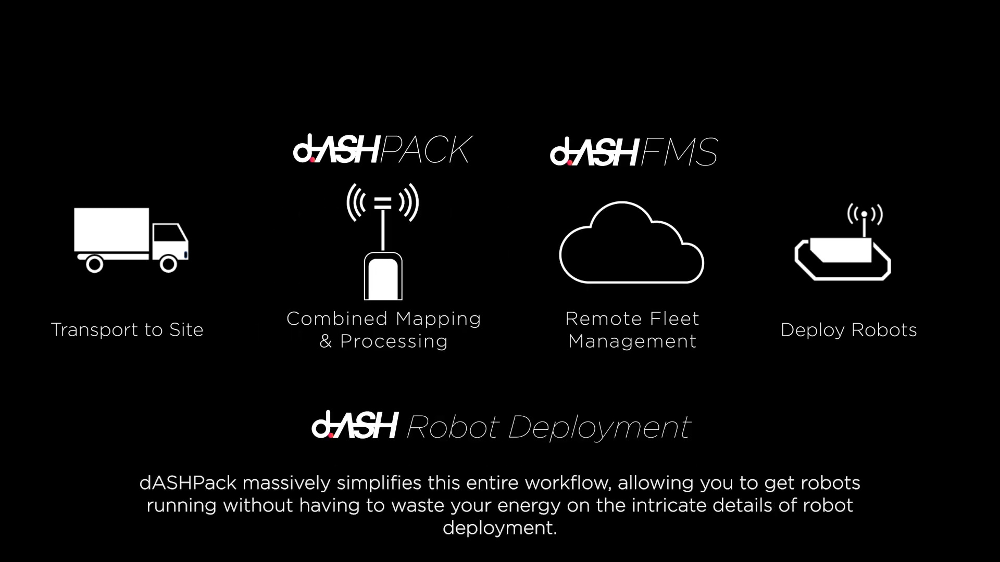

# d.ASH Pack
| { align=center style="width:600px"} | 

**d.ASH Pack** is a mobile sensor system that allows users to create 3D Navigation Maps for Robot Autonomy. **d.ASH Pack** can either be worn on the back of the user (just like a backpack) or mounted on a robot. It works with **d.ASH Xplorer** application to generate a 3D pointcloud map. The entire workflow is fully integrated with d.ASH Fleet Management system.

| { align=center style="width:600px"} | 

You can view a short video overview of how **d.ASH Pack** integrates into your Autonomous Robot Deployment workflow [here](https://youtu.be/9q2ROiMkSFI)

## Requirements
- A Windows 10 / Ubuntu PC with a decent GPU
- d.ASH Pack device
- Internet Connection (Contact us if you prefer the version without any internet connection and Fleet Management integration support). This guide assumes that you have an internet connection throughout the entire workflow.

### 1.1 Quick Start
A 3D map is created in two steps: data collection and data processing. 

Data collection requires the d.ASH Pack device. There are 3 different ways to activate the data collection process as listed below. If you do not have access to the Internet connection, please make sure to use Option 1 which allows you to activate the data collection via your phone.

Data processing requires the d.ASH Xplorer application and Internet connection. The d.ASH Xplorer software is used to process the recorded data, create and edit 3D maps, and upload data to the Fleet Management cloud.

### 1.2 Data Collection
**Option 1 - Connect d.ASH Pack via Wifi Network (No internet connection required)**

1. Power up d.ASH Pack
2. Connect to d.ASH Pack's Wifi network from your phone or other electronic devices. 
3. Open your web browser and key in "https://10.0.0.0/dashpack".
4. Name your d.ASH Pack recording file and tap start.
5. Walk around to cover the area that you would like to map. For better quality, please make sure to walk in loops back to previously visited areas.
6. Once you are done, stop recording.

**Option 2 - Connect to https://dc-blah-blah.com/dashpack**

1. Power up d.ASH Pack
2. Open your web browser and key in "https://dc-blah-blah.com/dashpack".
3. Login with your d.ASH credentials.
4. Name your d.ASH Pack recording file and tap start.
5. Walk around to cover the area that you would like to map. For better quality, please make sure to walk in loops back to previously visited areas.
6. Once you are done, stop recording.

**Option 3 - Use d.ASH Xplorer**

1. Power up d.ASH Pack
2. Load your d.ASH Xplorer application on your PC
3. Login with your d.ASH credentials.
4. Click on "d.ASH Pack Manager" tab  at the top.
5. Select your d.ASH Pack.
6. Click on "d.ASH Pack Recording Control"
7. Key in your d.ASH Pack recording file name and click start.
8. Walk around to cover the area that you would like to map. For better quality, please make sure to walk in loops back to previously visited areas.
9. Once you are done, stop recording.

### 1.3 Data Processing
1. Load up the d.ASH Xplorer Application
2. Login and click "d.ASH Pack Manager" tab at the top.
3. Your d.ASH Pack device should appear in the list. Select it by clicking on it.
4. Select the recording files that you wish to download.
5. If you connect an ethernet cable between d.ASH Pack and your PC, you will have options to download the recordings via either an ethernet cable or wirelessly. For fast download speeds, using an Ethernet cable is recommended.
6. Change 3D mapping configuration to suite the environment of the recording. For mapping configuration explanations/tips, please refer to Mapping Configs section in Xplorer guide.
7. Select the preferred recording file and click "Generate Map" to start the map generation.
8. While it is running, you will have the following options:
    <ul>
        <li><strong>Pause</strong>: Pause the mapping process (Appear if mapping is running)</li>
        <li><strong>Resume</strong>: Resume the mapping process (Appear if mapping is paused)</li> 
        <li><strong>Cancel</strong>: Cancel the mapping process</li>
        <li><strong>Checkpoint</strong>: Export the current 3D map to Map Editor. This is used to backup the mapping progress, if problems arise in the future some good results can be restored.</li> 
    </ul>

9. Once completed, click "Map Editor" to edit the generated map. The name of the new map is the same as the recording file's name.
10. Follow d.ASH Xplorer guide to edit the map accordingly.
11. Once you are satisfied with the 3D map, click "Upload" to upload the map to your d.ASH Fleet Management account in cloud.

### Tips
1. **Good Quality 3D Map** : It is recommended to walk in loops back to previously visited areas for map auto-correction. You will notice some automatic corrections being done during the mapping process on d.ASH Xplorer. These corrections are called loop-closure.
2. **Map Editing**: You can use d.ASH Xplorer map editing function to rotate and translate the maps. Map editing is recommended so that users can deploy their autonomous robot easily. We recommend rotating the map so that the ground plane is aligned with the grid on d.ASH Xplorer.
3. **Fast Record Downloading**: To achieve high-speed d.ASH Pack recording retrieval, please connect an ethernet between the d.ASH Pack and your PC running d.ASH Xplorer.
4. **Slow Visualization**: If you encounter a slow/laggy visualization or pointcloud editing, you can downsample the pointcloud. This will increase the FPS of visualization/processing. Once the editing work is done, you can restore the pointcloud density and export or upload the pointcloud.
5. **Autonomy**: If you are planning to export the pointcloud map without going through our Fleet Management system, we recommend that downsample the pointcloud before you export. This will speed up the map loading process on the robots.

