# d.ASH Xplorer

| { align=center style="width:600px"} |

d.ASH Xplorer is *the* 3D point cloud management application, allowing users to create, edit and export 3D point cloud for various purposes such as for Autonomous Navigation and Digital Twin Applications. d.ASH Xplorer is designed to work with d.ASH Pack and equipped with state-of-the-art SLAM technology for 3D point cloud generation. Users can edit the 3D point cloud by rotating, translating, downsampling, and cleaning up point clouds. 2D maps can also be generated from the 3D point clouds using the built-in grid map generator. The entire point cloud generation workflow is fully integrated with [d.ASH Fleet Management](https://www.dconstruct.co/products) to significantly shorten and streamline the preparation process for autonomous navigation.

Two versions of d.ASH Xplorer are available. **d.ASH Xplorer** and **d.ASH Xplorer Pro**.

*d.ASH Xplorer Pro* is equipped with other add-on features such as the **Scan Manager** which provides scanning support and automatic stitching of dense 3D point cloud scans. AutoMerge utilises sensor fusion to perform automatic scan alignment and scale-consistent stitching with little human intervention. The AutoMerge system currently supports the Leica BLK360. Other features include uploading of Navigation Maps to the cloud and exporting maps to Revit.

Since d.ASH Xplorer is fully integrated with [d.ASH Fleet Management system](https://www.dconstruct.co/products), an internet connection is required. Should you require d.ASH Xplorer without an internet connection, please [contact us](mailto:hello@dconstruct.ai) for more details.

## Minimum System Requirements

1. PC with a CPU equivalent to or greater than an Intel i5 4th Gen or AMD R5 2000 series
2. 16GB of RAM
3. Internet Connection
4. Windows 10/11

*We recommend using an Nvidia discrete GPU greater than or equivalent to a GTX 960. Some features such as "HD View" are disabled on other GPUs.*

 **d.ASH Xplorer is built for Windows 10/11. Therefore, please ensure you are running a Discrete Nvidia GPU in High-Performance mode. Otherwise, some functionalities would be unsupported. You can enable this by going into Windows GPU Settings, and adding d.ASH Xplorer as an app and setting the "Graphics preference" to "High performance".**

### Tutorial

| { align=center style="width:600px"} |

You can watch the video tutorial to get a quick overview of how to run d.ASH Xplorer above [here](https://youtu.be/s6JCzOCB8DE).

**Control Scheme**

d.ASH Xplorer's control scheme is as follows:

- WASD: Navigate around the point cloud
- LMB/MB1: Drag mouse to pan around the point cloud
- RMB/MB2: Drag mouse to zoom in and out
- MMB/MB3: Drag mouse to navigate around the point cloud
- E: Move upwards(positive) in the Y-axis
- Q: Move downwards(negative) in the Y-axis
- F: Returns view to origin

### 2.1 Quick Start

For a more detailed look at the different features d.ASH Xplorer has to offer, please refer below. This is just a brief overview on how d.ASH Xplorer should be used.

1. Download the .dpack recording from your d.ASH Pack
2. Click on the *Generate Point Cloud* button
3. Once the map is generated, configure the *Post-processing Settings* by changing the *Post Processing Options* dropdown to Nav Map
4. Then click *Post Process*
5. Navigate to the *Point cloud editor*
6. Click *Upload Nav Map* [d.ASH Xplorer Pro only]

The generated recording can now be used for robot autonomous navigation with [d.ASH Fleet Management system](https://www.dconstruct.co/products).

### 2.2 Modes

d.ASH Xplorer has 2 main modes for various tasks:

1. **Point Cloud Editor**: Perform 3D point cloud edits, exports and uploads.

| { align=center style="width:600px"} |

2. **d.ASH Pack Manager**: Control d.ASH Pack and generate 3D point clouds and 2D maps.

| { align=center style="width:600px"} |

**d.ASH Xplorer Pro** also includes:

1. **Scan Manager**: Download point cloud data and perform AutoMerge on 3rd party 3D scanners.

| 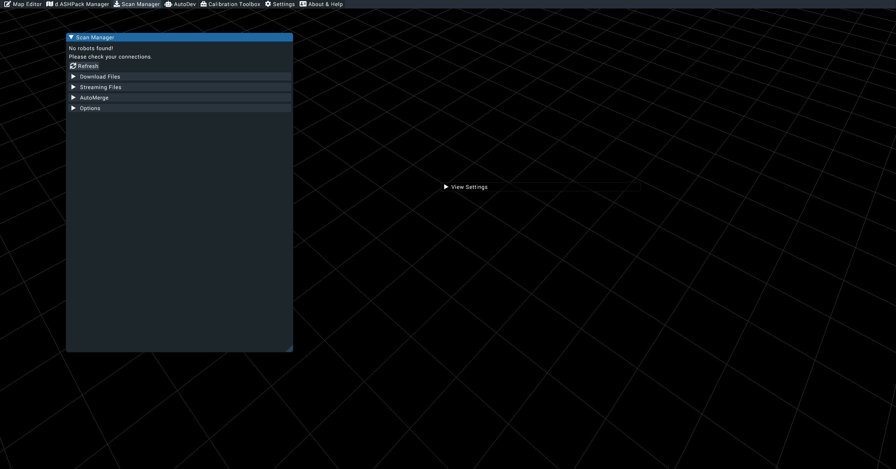{ align=center style="width:600px"} |

These 3 modes form 3 different tabs at the top of d.ASH Xplorer.

### 2.3 Point Cloud Editor

The point cloud editor is used to manage different point clouds that users have generated. Users can rotate, translate, downsample and perform other 3D point cloud editing features.

You can use this mode to visualize the 3D point cloud by using the **Load** button. File extensions ".pcd", ".obj", ".las" and ".e57" are currently supported. We also have our own proprietary file extension ".dcloud" which can be used to load point clouds. *We do not recommend exporting large point clouds (> 1gb in size) in the .pcd format. Please export such files in .las, .e57 or .dcloud instead.*

| { align=center style="width:600px"} |

After loading, your 3D objects will appear in the list under **Point Cloud Collections**. You can hide or show a point cloud object by clicking the green eye icon.

| { align=center style="width:600px"} |

The **Remove** button simply removes the 3D object from the list. However, it does not delete the file from the PC.

| 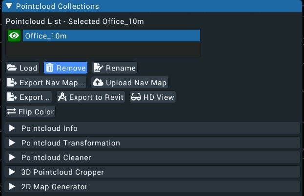{ align=center style="width:600px"} |

The **Rename** button renames the selected 3D object name.

| 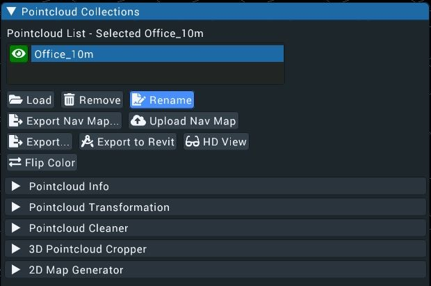{ align=center style="width:600px"} |

The **Export Nav Map** button exports not just the selected 3D object, but the 3D object's 2D Grid Map and Configuration files for navigation, to a destination of your choice. When clicked, a file dialogue will pop up for you to choose the save folder destination. 3 different files will be saved. They are the 3D point cloud (.pcd), 2D map (.png), and map configuration (.json).

| 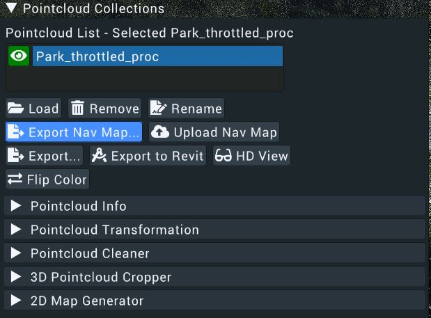{ align=center style="width:600px"} |

The **Export** button exports the selected 3D object to a destination of your choice. When clicked, a file dialogue will pop up for you to choose the save folder destination.

| { align=center style="width:600px"} |

The **HD View** button allows for high-resolution views of the full point cloud data including moving and rotating the point cloud in real-time at high frame rates while also being in full colour. **An Nvidia discrete gpu with CUDA capabilities is required.**

| { align=center style="width:600px"} |

The **Flip Colour** button flips the colours of points in the point cloud from RGB to BGR and vice versa, this may help resolve issues with colours not appearing properly or correctly on your point cloud.

| { align=center style="width:600px"} |

*The following options are locked to **d.ASH Xplorer Pro***

The **Upload Nav Map** button uploads the 3D map to the [d.ASH Cloud Fleet Management System](https://www.dconstruct.co/products). If a map with the same name is found in the cloud, a warning will pop up and ask the user to either overwrite the existing file or cancel the uploading operation. Once uploaded, users can access or download the map from the cloud.

| { align=center style="width:600px"} |

The **Export to Revit** button exports the selected 3D object for use with Revit.

| 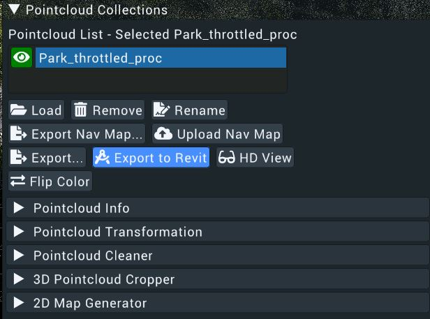{ align=center style="width:600px"} |

The **Multi Point Cloud Processor** allows users to
- align different point clouds through geometry. This is useful for stitching scans of different parts of an area together.
- merge the point clouds into a single, final point cloud
- compare between different point clouds. There are a few different options for comparing point clouds.

To process the point clouds, just select the point clouds you want to process and options to *Align*, *Merge* and *Compare* will appear. A checkbox for the *Swap Alignment Indices* property will appear as well.

| 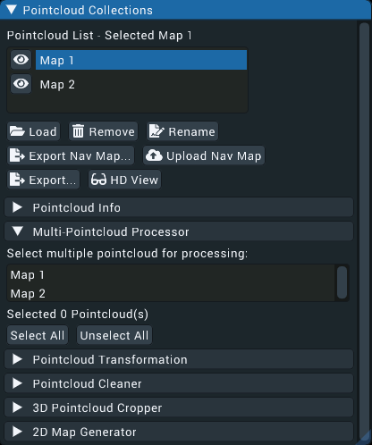{ align=center style="width:600px"} |

*Swap Alignment Indices* means when alignment is done, the target and source points are swapped (i.e. instead of point A trying to match against point B, point B tries to match against point A) *[Default: Unchecked]*

**Aligning point clouds**
Point clouds taken/generated can be aligned and made to match one another in d.ASH Xplorer. This can aid in comparing and merging of the point clouds. In order to align the point clouds, just click the *Align* button and d.ASH Xplorer will auto align the point clouds for you.

| 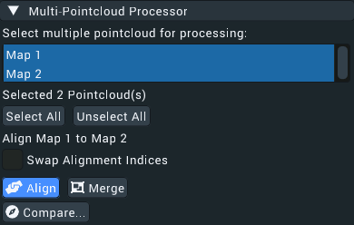{ align=center style="width:600px"} |

**Merging point clouds**
Point clouds taken/generated can be merged into one point cloud in d.ASH Xplorer. *Please ensure the point clouds are aligned first, as merging without aligning can lead to very undesirable results*. To merge the point clouds, just click the *Merge* button.

| 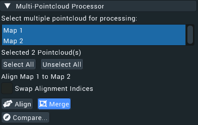{ align=center style="width:600px"} |

**Comparing point clouds**
Point clouds taken/generated can be compared against one another. *Please ensure the point clouds are aligned first, as comparing without aligning can lead to very undesirable results*. To compare the point clouds, click the *Compare* button.

| { align=center style="width:600px"} |

The following comparison settings are shown after clicking *Compare*:
- Comparison Resolution (m): Points will be grouped into a voxel the size of the value set. This will be used to compare the point clouds voxel by voxel. *[Default: 0.8]*
- Align Before Comparison: Aligns the point clouds before comparison takes place *[Default: Unchecked]*

| { align=center style="width:600px"} |

Point clouds can be compared with three different measurements which are:
- Points added: Comparing point cloud 1 and 2, what are the points added between the two point clouds. This is visualised in green points.
- Points removed: Comparing point cloud 1 and 2, which points are removed between the two point clouds. This is visualised in red points.
- Points unchanged: Comparing point cloud 1 and 2, what are points which are the same/retained between the two point clouds. This is visualised in blue points.

You can enable or disable the different views by clicking on the checkboxes.

| { align=center style="width:600px"} |

### 2.4 Point Cloud Transformation

This feature allows users to edit the point cloud. Users can perform **translation** and **rotation** by using XYZ and quaternion values respectively. There are options for users to reset the transformations back to the original state.

In addition, a widget in the centre of the screen, which only appears when the tab is open, is designed to facilitate point cloud transformation. Users can click on the widget and see a live transformation of the 3D object. To toggle between translation and rotation modes of the widget, users can choose the right mode under "Edit Mode".

| { align=center style="width:600px"} |

Users can perform downsampling from the same dropdown menu and have the ability to set their desired voxel grid size. The values are in Metres. Therefore, a voxel size of 0.2 for downsampling would mean that for every 0.2M HxWxB Cube, all points are removed except for one. **Reset to Original** resets the 3D point cloud to the original number of points.

| { align=center style="width:600px"} |

### 2.5 Point Cloud Cleaner

The **Point Cloud Cleaner** helps to remove outliers and smoothen the point cloud to make it cleaner. An explanation of the available options is located below the image.

<!-- Insert image here -->
| { align=center style="width:600px"} |

*Point cloud Denoiser*
<ul>
    <li><strong>Denoise Quality</strong>: Depending on your system, <i>Rough</i> could still take a few minutes to half an hour. This setting controls the number of iterations the algorithm will run. <i>Refined</i> therefore means the denoise will be more accurate as more iterations of the algorithm will be ran.
     <i>[Default: Rough]</i></li>
    <li><strong>Denoise Aggressiveness</strong>: The denoiser tries to both remove points and also move points to make the point cloud less noisy. The higher this is set, more points will be removed.
     <i>[Default: Medium]</i></li>
    <li><strong>Chunk Size (m)</strong>: The point cloud is split into chunks of equal size for denoising. This controls the size of each chunk. For users with less ram, it is recommended to keep to the default or lower the Chunk Size to prevent crashes and other instabilities.
     <i>[Default: 50.0]</i></li>
    <li><strong>Uniform Sampling</strong>: Tries to accentuate surfaces perceived on the point cloud, turn this setting off if shapes are being distorted on the point cloud.
     <i>[Default: Unchecked]</i></li>
</ul>

The options listed below are for advanced users, please use them at your own discretion.

<i>Statistical Outlier Removal:</i>
<ul>
    <li><strong>K-Mean (Number of Neighbours)</strong>: For each point, its surrounding points will be used to calculate the standard deviation in distance between points. A higher value means more surrounding points will be considered. <i>[Default: 50]</i></li>
    <li><strong>Standard Deviation</strong>: A measure of the variation between points. A higher deviation means that points further away from each other will be kept. <i>[Default 2.00]</i></li>
</ul>

<i>Point Cloud Smoother:</i>
<ul>
    <li><strong>Radius (m)</strong>: The searching radius per point. The higher the radius, the more time the denoising will take, but the denoising output will be better. <i>[Default 0.50]</i></li>
    <li><strong>Epsilon (Smoothness)</strong>: The larger the value, the smoother the output will look. <i>[Default 0.20]</i></li>
</ul>

<i>Point cloud Resampling:</i>
<ul>
    <li><strong>Polynomial Order</strong>: The higher the number, the sharper the edge the denoising can preserve. <i>[Default: 3]</i></li>
    <li><strong>Search Radius</strong>: Look through all points within the search radius and perform polynomial fitting of the order specified above. <i>[Default: 0.05]</i></li>
</ul>

| { align=center style="width:600px"} |

### 2.6 3D Point Cloud Cropper

This feature helps users clean up point clouds by cropping them down to a desired section/size. An explanation of the available options are below the image

| { align=center style="width:600px"} |

<ul>
    <li><strong>Visualise Cropping Bounds</strong>: Draws the cropping bounds on the preview, allowing users to better see the area remaining after cropping.
     <i>[Default: Unchecked]</i></li>
    <li><strong>Range X,Y,Z</strong>: The cropping ranges, adjust these values to adjust the area remaining after cropping.
     <i>[Default: -10.000, 10.000]</i></li>
    <li><strong>Auto Set Crop Ranges</strong>: d.ASH Xplorer will auto set the crop ranges based on the 3D point cloud.
    <li><strong>Crop Point Cloud</strong>: Crops the point cloud according to the specified ranges set above.</li>
    <li><strong>Reset Crop</strong>: Resets any crop operations, restoring the original point cloud.</li>
</ul>

### 2.7 2D Map Generator

This feature creates a 2D map from a 3D point cloud by projecting a section of the 3D point cloud to an image file. Users can generate the 2D view from either a *top view perspective* or *side view perspective*. Users have 3 different configuration options: min height, max height, and pixel resolution (meter/pixel). To see which region is used for compression, users can check *Show Height-Bounds* to display the minimum and maximum height planes.

| { align=center style="width:600px"} |

Once satisfied, click **Generate** to apply the configurations and view the 2D map.

| 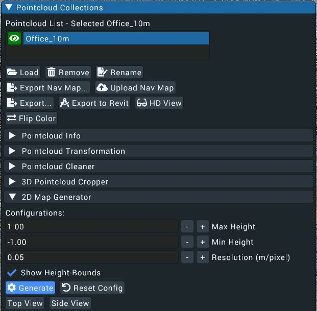{ align=center style="width:600px"} |

Users can choose to **Save 2D Map** separately if needed.

It is recommended to ensure that the free space is correctly represented because this information will be used for automatic path-planning and visualization on the website. However, if you do not intend to use d.ASH automatic path-planning, getting a clear 2D map for visualization is sufficient.

### 2.8 d.ASH Pack Manager

This mode allows users to start/stop d.ASH Pack recordings, download d.ASH Pack recordings and generate 3D point clouds through the *d.ASH Pack Manager* window.

Users can only start/stop d.ASH Pack recordings and download d.ASH Pack recording files when d.ASH Xplorer detects that there are online d.ASH Packs. Otherwise, "No online d.ASH Pack found" will be shown.

| { align=center style="width:600px"} |

If there is an online d.ASH Pack, the d.ASH Pack name will pop up on the list of online d.ASH Pack. Click on it to select the d.ASH Pack device.

### 2.9 d.ASH Pack Control

This section allow users to start/stop d.ASH Pack recordings.

1. Log in to d.ASH Xplorer
2. If offline, connect to d.ASH Pack Wi-Fi
3. Navigate to the d.ASH Pack Manager
4. Before starting the recording, ensure d.ASH Pack is powered on and is emitting a **Green** light from the status LED, this represents that d.ASH Pack is ready to be used for recording.
5. In d.ASH Xplorer, key in the d.ASH Pack recording name and specify if images should be captured. Images provide colour to the final generated 3D point cloud
6. click the **Start** button.
7. To monitor the recording status, in d.ASH Xplorer, the d.ASH Pack status will reflect **Recording**. On the d.ASH Pack itself, the status light will flash **Yellow**.
8. To stop, click the **Stop** button. Note that the user can also force stop via pressing the power button, however, only do this as a last resort on the off chance that the stop button isn't functioning.

### 2.10 Download d.ASH Pack Recordings

After clicking on the list of d.ASH Pack, perform the following steps to download the recording:

| { align=center style="width:600px"}

1. Select the desired d.ASH Pack recording file from the recording list.

| 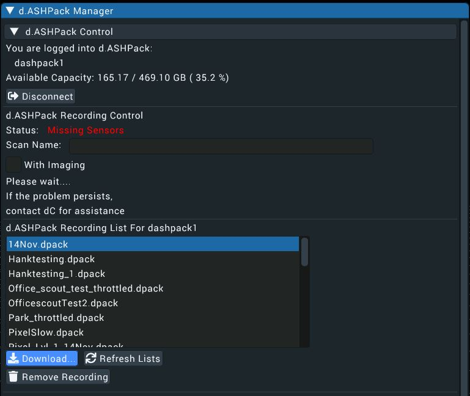{ align=center style="width:600px"}

2. If there is an ethernet connection between the PC running d.ASH Xplorer and d.ASH Pack, users will have options to download either wirelessly or via ethernet. It is recommended to download via ethernet for faster downloading speed.

| { align=center style="width:600px"}

3. Click **Download** to start downloading.
4. Once it is completed, the downloaded file will appear in the *Downloaded d.ASH Pack Recordings* list ready for 3D point cloud generation.

| { align=center style="width:600px"} |

### 2.11 3D Point Cloud Generation

After downloading the d.ASH Pack recording, you can then generate the 3D point cloud for that particular recording.

1. Under **Point Cloud Generation Configs**, users can choose different settings for the 3D point cloud generation. For details on the configuration, please refer to the next section

| 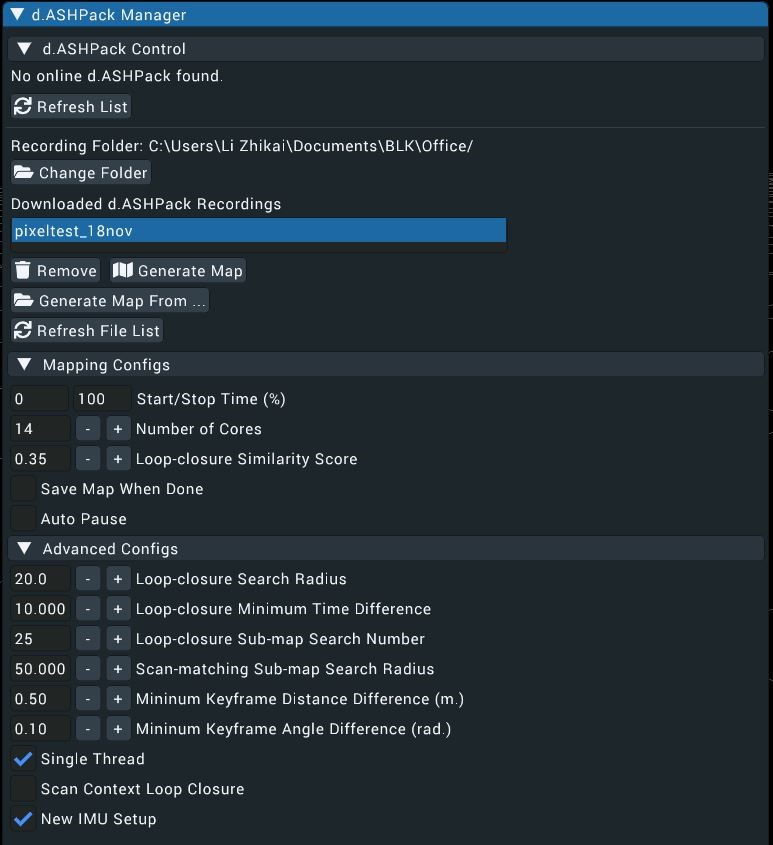{ align=center style="width:600px"} |

2. Select d.ASH Pack recording by clicking on the recording name under the *Downloaded d.ASH Pack Recordings* list.

| { align=center style="width:600px"} |

3. Click **Generate Point Cloud** to start the 3D point cloud generation. You will see the 3D point cloud being generated progressively on the screen. A green line appearing on the screen represents the path taken during the recording process.
4. While the 3D point cloud is being generated, users will have the following options:

| 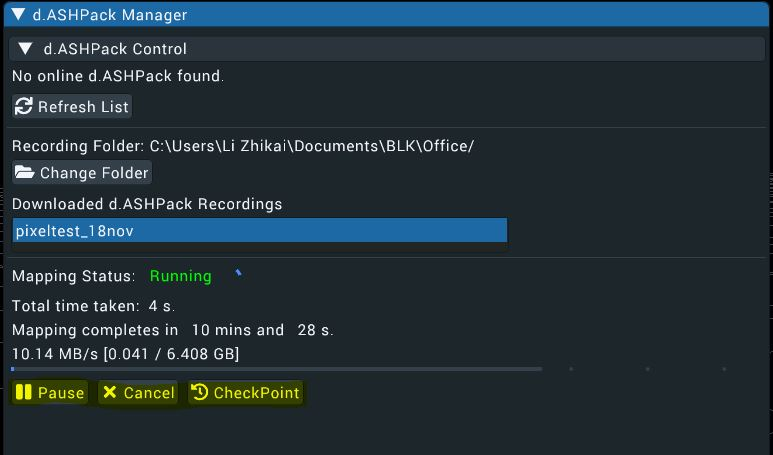{ align=center style="width:600px"} |
    <ul>
        <li><strong>Pause</strong>: Pause the generation process (Appears if generation is running)</li>
        <li><strong>Resume</strong>: Resume the generation process (Appears if generation is paused)</li>
        <li><strong>Cancel</strong>: Cancel the generation process</li>
        <li><strong>Checkpoint</strong>: Export the current 3D point cloud to the Point Cloud Editor. This is used to back up the 3D point cloud in case there are problems later on.</li>
    </ul>
5. When generation is completed, the completed point cloud will need to undergo *post-processing* so the generated point cloud can be used for specific purposes such as for autonomous navigation or to include colour data

6. The point cloud will now be automatically added to the point cloud list under *Point Cloud Editor* for other purposes such as editing and uploading.

### Post Processing

By clicking on the drop-down menu, the following options to add *post-processing* effects are shown.

- *Nav Map*: autonomous robot navigation map.
- *Colour Nav Map*: autonomous robot navigation with colour.
- *Sparse Coloured Map*: coloured point cloud with as few points as possible.
- *Dense Coloured Map*: coloured point cloud with many points.
  - *downsampling* reduces the number of points in the final point cloud while maintaining the original structure of the point cloud.
  - *Grid size for downsampling* influences the resolution of the downsampled point cloud

| { align=center style="width:600px"} |

### Point Cloud Generation Configs

To ensure desirable generation quality, users may have to edit the default settings to suit their requirements. To reset the settings back to default, click the reset button.

Users have the following options:

1. **Start/Stop Time(%)**: Users can perform 3D point cloud generation for a part of the d.ASH Pack recording by specifying the start and stop time in percentage (from 0-100%) *[Default: 0-100%]*
2. **Number of Threads**: Users can manually set the number of threads d.ASH Xplorer can use. The higher the number, the faster the point cloud generation will be. A higher number of threads used for d.ASH Xplorer may cause other system processes to become more laggy. *[Default: Depends on numbers of cores on client system]*
3. **Loop-Closure Similarity Score**: The lower this value, the more stringent loop closure will be when finding similar points. Increase this value in 0.10 intervals. *[Default: 0.30]*
4. **Save Point Cloud When Done**: When checked, the 3D point cloud will be automatically exported to the *Point Cloud Editor* when the generation has completed. *[Default: Unchecked]*
5. **Auto-Pause**: Point Cloud Generation will be automatically paused when a huge change in position is detected. This is useful for backing up the currently generated data in case of generation failure. *[Default: Unchecked]*

The **Max Point Cloud Range per Scan (m)** is the distance from the origin where points will be considered and added to the final, post-processed point cloud. Please increase the value when in wider areas such as when post processing outdoor areas. We recommend a minimum of 30.0 for outside areas. *[Default: 10.0]*

| 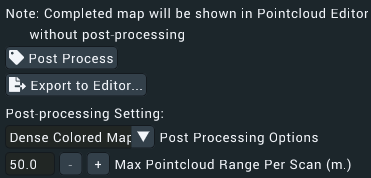{ align=center style="width:600px"} |

The **Dynamic Point Removal** checkbox allows for removal of unwanted objects from the final point cloud (e.g. pedestrians walking past, cars, pets etc) *[Default: Unchecked]*

**Use GPU for Inference** is essentially hardware acceleration for *Dynamic Point Removal*. We recommend turning this on. An Nvidia GPU with CUDA is required. *[Default: Unchecked]*

**Set Dilate Kernel Size** The higher/larger this value, the more points surrounding the moving object/object to be removed, will be removed. *[Default: Medium]*

| { align=center style="width:600px"} |

**Advanced Generation Configurations**

The options listed below are for advanced users, please use them at your own discretion.

1. **Loop Closure Search Radius (m)**: Used for automatic Loop Closure detection. Scan points within this radius are considered for Loop Closure. *[Default: 20.0]*
2. **Loop Closure Minimum Time Difference (s)**: A certain amount of time must pass before points can be considered for Loop Closure. This is to prevent consecutive poses from being used as Loop Closure candidates. *[Default: 10.000]*
3. **Loop Closure Sub-Map Search Number**: When a loop closure is found, this value will control the number of neighbouring LiDAR scans from each candidate pose which are concatenated together for the purpose of performing scan matching. *[Default: 25]*
4. **Scan-matching Sub-map Search Radius (m)**: During scan to map matching, this value controls the neighbouring distance from the current pose in which scan matching is done. *[Default: 20.000]*
5. **Minimum Keyframe Distance Difference (m)**: This value controls the minimum distance between each LiDAR scan which is used for mapping. *[Default: 0.50]*
6. **Minimum Keyframe Angle Difference (rad.)**: This value controls the minimum angular displacement between each LiDAR scan which is used for mapping. *[Default: 0.10]*
7. **Fast Mode**: Uses multiple threads to run map generation. This will be faster than using a single thread but may result in a lower quality map, especially in complex areas with little features such as buildings. *[Default: unchecked]*
8. **Scan Context Loop Closure**: Advanced Loop Closure algorithm. Checking this will result in more scan posititions being considered for loop closure, thus generating a higher quality map. *[Default: unchecked]*

**What is Manual Loop Closure Detection?**
In the event that 3D Point Cloud Generation is unable to detect loop closures (a pair of scan points with similar locations) at certain areas of a point cloud, you can perform *Manual Loop Closure Detection* to stitch these parts of the point cloud together. *Manual Loop Closure Detection* works by trying to pair every point selected with each other in all permutations possible.

During point cloud generation, if Loop Closures are not detected, pause the generation and perform *Manual Loop Closure Detection* by following the steps below.

Example of a map which requires *Manual Loop Closure Detection*:

| { align=center style="width:600px"} |

What the area should be like: 

| 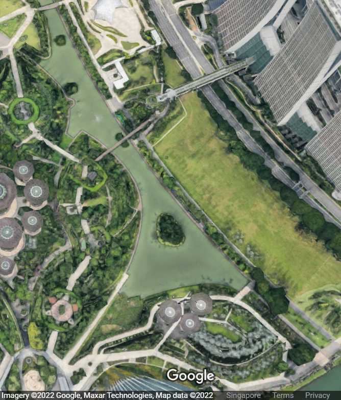{ align=center style="width:600px"} |

1. Select a few pairs of points for *Manual Loop Closure Detection*. Selected points that should be linked together. An example of this is shown below.

| { align=center style="width:600px"} |

2. If you selected the wrong pair of points, highlight the wrong pairs and click the *Remove Keyframes* button

| 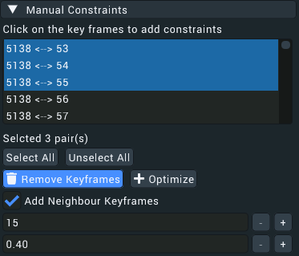{ align=center style="width:600px"} |

3. Select all remaining pairs and click *Optimize* and wait for the algorithm to match the points together.

| 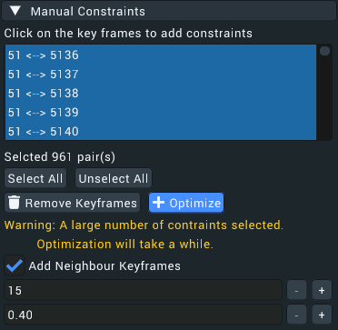{ align=center style="width:600px"} |

4. If no loop closures are able to be detected, increase the similarity score, then attempt optimisation again.

| 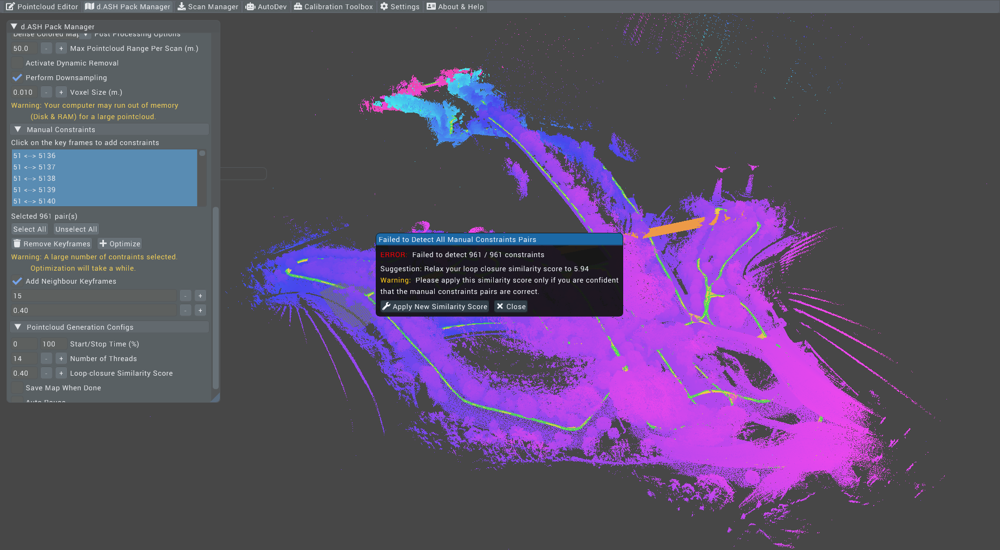{ align=center style="width:600px"} |

5. If needed, continue with manual loop closure detection on other parts of the point cloud.

*Final loop close

| 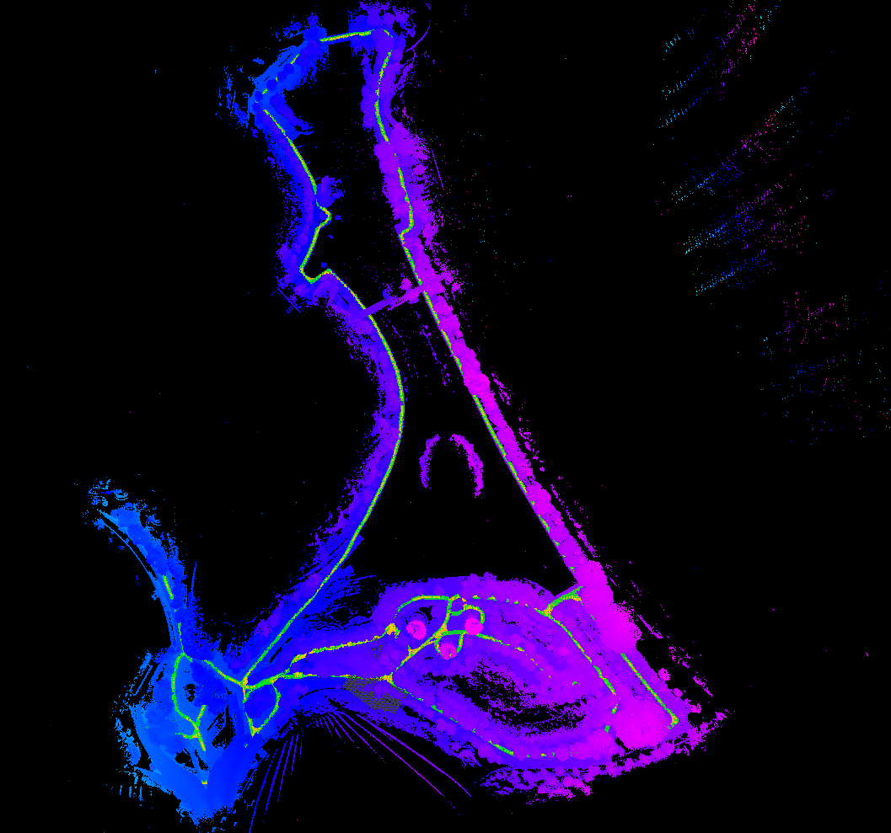{ align=center style="width:600px"} |

**Manual Loop Closure Detection Settings** 
- Add Neighbour Keyframes: Also adds keyframes beside the selected keyframe. The number of keyframes added is determined by the *Neighbour Size* value. *[Default: Checked]*
- Neighbour Size: The number of neighbour keyframes. *[Default: 5]*
- Similarity Score: The lower this value, the more stringent loop closure will be when finding similar points. Increase this value in 0.10 intervals. *[Default: 0.30]*

These values are only for manual loop closure, automatic loop closure configurations are listed above.

**Tips**

1. If the Manual Loop Closure Detection fails, users may want to lower the Loop Closure Similarity Score value based on the pop-up.
2. Ensure that there are not too many large point clouds in d.ASH Xplorer's point cloud manager. These are loaded into RAM and can cause instability when too many of such point clouds are loaded.
3. If you are confident that selected points are at the same location but the Loop Closure algorithm has failed to find similarities, please adjust the *Loop Closure Similarity Score* to a higher value. Once some loop closures are detected, you may observe some adjustments in the generated point cloud. You can then lower the score and perform Loop Closure again on different points to progressively correct the generated point cloud.

### Scan Manager (Plugin)

This plugin allows users to manage 3rd-party 3D scanners. Currently, the Leica BLK360 scanner is supported. This is currently limited to users of **d.ASH Xplorer Pro**.

This plugin is used to perform the following:

1. Download scanMeta files from the robot
2. Download scan data from the scanner
3. Perform **AutoMerge** on all scans.

**Download ScanMeta Files**

scanMeta file (`*.scanMeta`) holds critical information for each scan point. Each 3D scan activated by the d.ASH robotics stack will generate a scanMeta file. The scanMeta data can be used to perform AutoMerge for creating a digital twin (high accuracy/density 3D point cloud model). scanMeta files are grouped by their project names which are set by d.ASH Autonomy Mission.

To download the scanMeta files, perform the following:

1. Connect your PC running *d.ASH Xplorer Pro* to the Internet and make sure that the robot is online
2. Log in to *d.ASH Xplorer Pro*, then connect to the server.
3. Click on the robot from the *Online Robot List* in the *Scan Manager* tab.
4. Select the desired data folder by clicking **the Folder icon**. This folder will be used to store downloaded scanMeta files. We recommend choosing an empty folder. Otherwise, scanMeta files from previous/other projects will be overwritten.
5. Click on *Download Files* to expand the window.

| 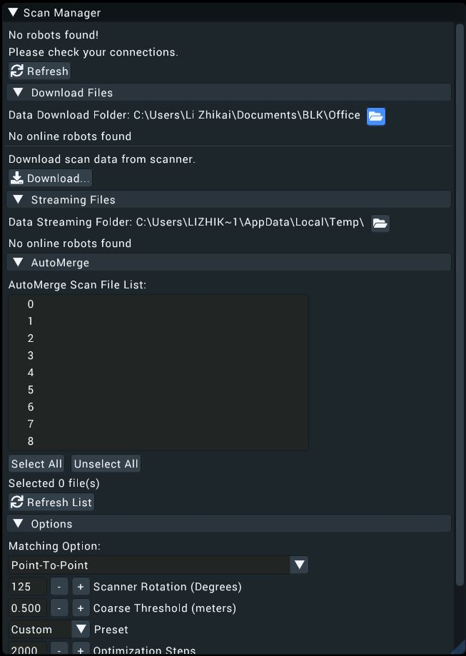{ align=center style="width:600px"} |

6. Click **Download** to download ScanMeta files for the entire project.

| 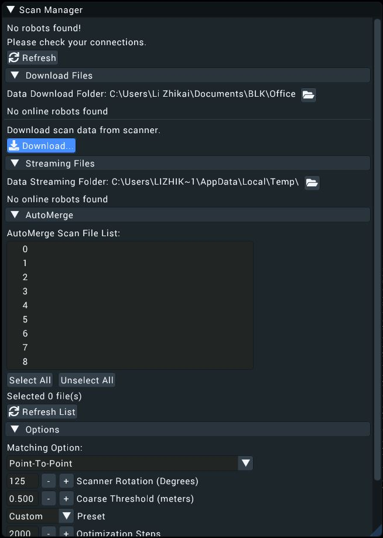{ align=center style="width:600px"} |

7. After downloading, all ScanMeta files will be stored in the folder selected in Step 3.

**Download 3D Scan Data from the Scanner**

This step performs downloading of 3D scan data from the 3D scanner by using the downloaded ScanMeta files.

1. Connect your PC running *d.ASH Xplorer Pro* to the 3D scanner.
2. Select the desired data folder by clicking **the Folder icon** . This folder should have ScanMeta files.
3. Click on *Download Files* to expand the window.
4. Under "Download scan data from scanner", click **Download**
5. There will be a window popup showing all ScanMeta filenames found in the folder selected in Step 2. If 3D scan files and ScanMeta files with the same name exist, the filename will have "[Downloaded]" appended at the back of their names.
6. Use the checkboxes on the left to mark 3D scan data for downloading. Users can use **Select All** or **Unselect All** buttons for file selections.

| 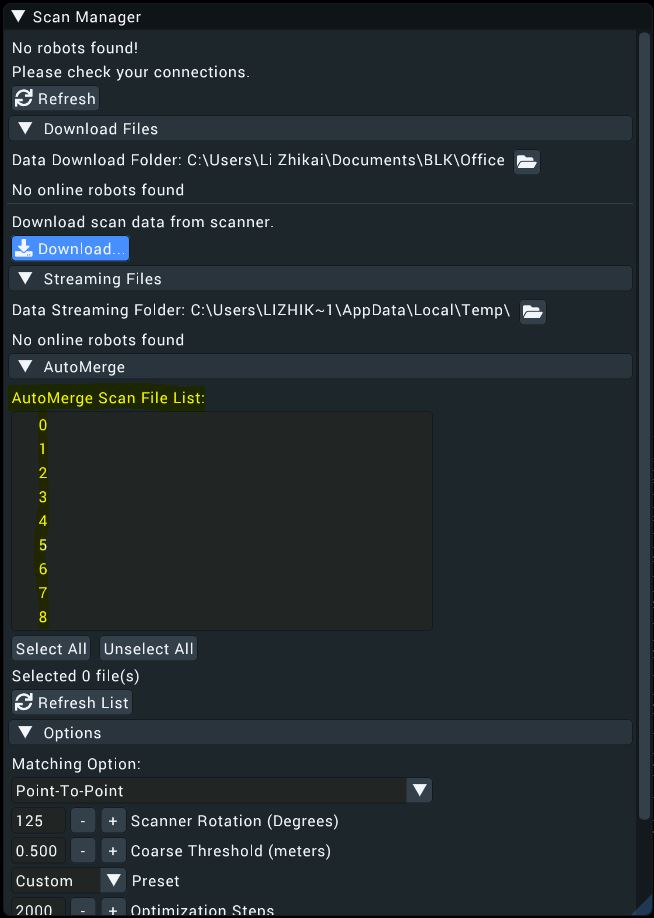{ align=center style="width:600px"} |

7. Click **Download** to start the 3D scan downloading process.
8. Once completed, Click **Close** to close the popup.

**AutoMerge**

This step performs AutoMerge on the 3D Scan data. AutoMerge utilizes sensor fusion techniques to automatically stitch and align multiple 3D scans for scale-consistent digital twin reconstruction. AutoMerge supports both colored and non-colored point clouds. To perform AutoMerge, perform the following steps:

1. Select the desired data folder by clicking **Change**. This folder should have both ScanMeta files and 3D scan data files.
2. Click on *AutoMerge* to expand the window.
3. *AutoMerge Scan File List* displays a list of files in the selected folder for AutoMerge. Only filenames with `.scanMeta` and `.pcd` are considered for AutoMerge.
4. Since AutoMerge relies on the orientation of the 3D scanner to perform stitching, users are encouraged to preview some scans first. This is done by selecting a few scans (greater than two) and clicking **Preview**.
5. After scan previews have loaded, expand *Options* and change the **Scanner Rotation** so that the selected scans are roughly aligned. These rotations will rotate the 3D scan about their centres. As the scanner rotation is changed, the 3D scan previews will also be rotated accordingly. Users do not have to perfectly align the 3D scans manually. Just a rough estimate is sufficient.
6. After configuring the scanner rotation, users can start AutoMerge. Click **AutoMerge** to start the AutoMerge process on the selected files (greater than one). You will see the 3D scans popping up and aligning themselves automatically after some time.
7. When AutoMerge has completed, users have the following options:
    <ul>
        <li><strong>Export</strong>: Save the AutoMerge results and individual scans with corrected poses. Users can choose to export as `.pcd`, `.dcloud`, `.las`, or `.e57` file formats.</li>
        <li><strong>Edit</strong>: Export the AutoMerge results to <strong>Map Editor</strong> for editing.</li>
    </ul>

**Options**

There are 3 different options available for Scan Manager:

1. **Scanner Rotation**: Rotation in degrees of the scanner relative to the robot heading. As this value is changed, the 3D scan preview will also be updated in real-time.
2. **Optimize Visualization**: Check this to optimize rendering. Check this if you notice a laggy visualization.
3. **Auto save AutoMerge results**: Automatically save AutoMerge results to the data folder once AutoMerge has completed.